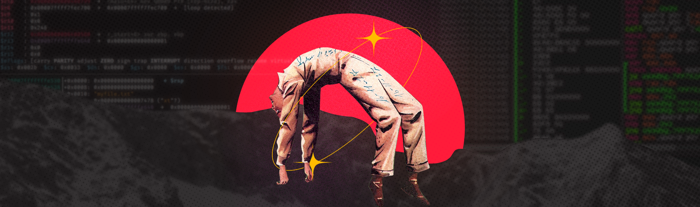

## hi there 👋🏿

   

## 👾 Contact me via:

## 👾 Currently interested on
- Tensorflow
- Data visualization
- Pipeline ETL

## 👾 About
Currently. I'm a computer engineering student , and at the moment I'm studying AI, including data analysis, machine learning models and statistics and mathematics.

#### ⚙️ Skills

  

## 👾 Profile stats

    

## 👾 Projects
- See my pinned repositories
- For more go to [projects github page](https://smrenato.github.io/projects/)
