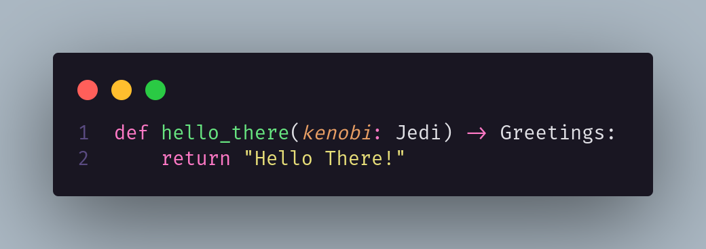

<p align="center" >
    </img>
</p>


&nbsp;
# 👾 Perfil
## [Sobre mim](#💡-sobre-mim) | [Contato](#📮-contato) | [Tecnologias](#💻-tecnologias-que-eu-estudo) | [Habilidades](#🤖-habilidades)
### 📕 [Estudando Modelos de Aprendizagem de Maquina](https://smrenato.github.io/datascience-projects/)


### 📕 [Visualização de dados e estatística]()

&nbsp;
# 💡 [Sobre mim](#👾-perfil)

```python

who_is_smrenato = str("""

Olá! 👋🏾

Meu nome é Renato, atualmente moro em João Pessoa, Paraíba. Sou uma pessoa esforçada e proativa, 
gosto de expor minhas ideias e aprender com experiências, estou sempre buscando melhorar, 
tenho uma paixão desde cedo pelo mundo da tecnologia, meu combustível sempre foi a curiosidade!

Atualmente.

Sou estudante de Engenharia de computação pela UFPB, no momento tenho me dedicado a me 
aprofundar no campo de AI, compreendendo análise de dados, modelos de machine learning e 
estatística.

""")
 


```
&nbsp;
# ⚙️ [Projetos](#👾-perfil)
## 📌Modelos Machine learning
[](https://github.com/smrenato/datascience-projects)

&nbsp;
## 📌  Visualização de dados
* breve

&nbsp;
# 🤖 [Habilidades](#👾-perfil)


&nbsp;
# 💻 [Tecnologias que eu estudo](#👾-perfil)

### Linguagens


### Frameworks


&nbsp;
# 📮 [Contato](#👾-perfil)
[](https://www.instagram.com/smrenato_)
[](https://www.linkedin.com/in/smrenatox/)
[](mailto:user@example.com)

&nbsp;
# 👾 [Profile stats](#👾-perfil)
<div align="center">
    <a href="https://github.com/smrenato">
        
    </a>
</div>

&nbsp;
## [Voltar ao topo](#👾-perfil)
